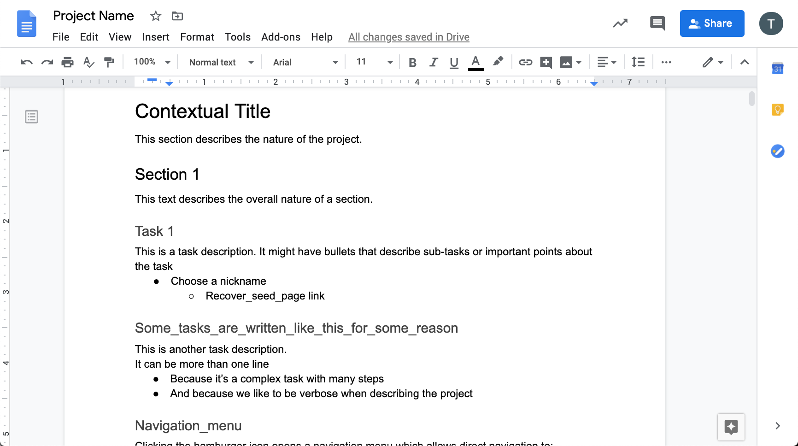
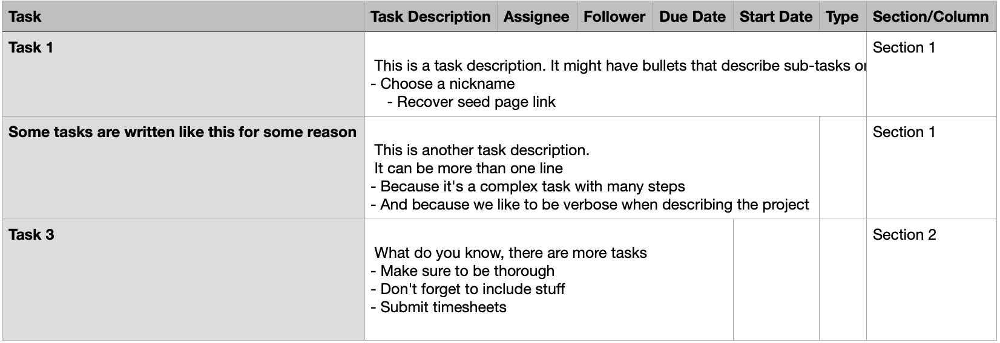

# GoogleDocTask 2 CSV

This project takes a specially formatted Google Doc and converts it to a CSV file.

The aim of this project is to create an [Asana-importable CSV task list](https://asana.com/guide/help/api/csv-importer).

The Google Doc must be formatted in a particular way, so that headers describe Asana, the sub-headers describe the task names, and the remaining paragraph text becomes each task description.

The goal is to convert this:


Into this:


## How to run

### Installation
This program runs from [`python 3`]([https://www.python.org/](https://www.python.org/)) from the command line and has a few dependencies.

Download source
```code
$ git clone https://github.com/backupbrain/googledoctask2csv.git
$ cd googledoctask2csv
```

Install dependencies:
```code
$ pip3 install -r requirements.txt
```

Run
```code
$ ./googledoctask2csv.py -h
usage: run_doc2task.py [-h] [--v]
client_secret_file oauth_token_file google_doc_url

Convert a Google Description of Work document into a Task list CSV. H2 ->
Section. H3->Tasks. The name of the document will become the filename.

positional arguments:
client_secret_file  Location of the Google App Client Secret file
oauth_token_file  Where to save the OAuth token file
google_doc_url  Google Doc URL

optional arguments:
-h, --help  show this help message and exit
--v, --verbose  Ouput debugging messages
```

### Usage

The usage is described with the `-h` flag. In short, it requires two file paths and a URL.

The file paths are:
- A JSON Google API Client Secret file (obtained through the [Google Developer Console](http://console.developers.google.com) (*read permission*)
- A path to save the OAuth2 credentials returned by Google when the user authenticates the app (*write permission*)
- A URL for a Google Doc. The doc must have a public URL with editing permissions or the API must have write permissions to the authenticated user's documents.
- (*optional*) -v or --verbose to print status messages

It outputs a CSV file in the running folder named after the Google Doc (*write permission required*)


## How this works
This works by inspecting each paragraph in a Google Doc and updating a state machine. For each paragraph, the paragraph style in inspected.
- If the paragraph has no formatting, it is appended to the existing task description. If no task descriptions exist, this step is skipped.
- If the paragraph is a bullet list, the indentation is measured to determine how deep the nesting of this list item is, so as to preserve list formatting in the final output, then it is appended to an existing task description if a task exists
- If the paragraph is a H2 header, a new section is created. Any exiting tasks are committed to the list
- If the paragraph is a H3 header, a new task is created and Any existing tasks are committed to the list

## Why this project exists
This project exists because my company produces many and lengthy requirements documents that I need to put into Asana.

They are consistently formatted but it takes me hours to import the tasks by hand and it's much faster to simply import the tasks.

## Why Not Import Directly Into Asana?
With a CSV file, I can quickly change all of the due dates, assignees, and other information. Once the data is in Asana, I have the problem of clicking each task to make changes rather than to alter all tasks at once or with a formula.